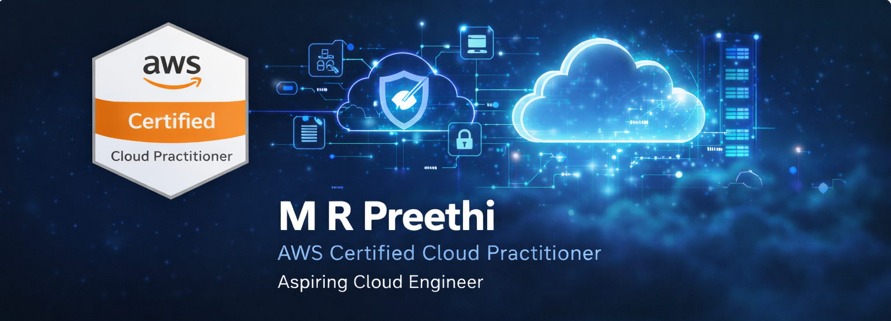

## AWS-Cloud-Practitioner-Portfolio

Hi, I'm Preethi M R.
This repository contains hands-on AWS Cloud Practitioner–level projects demonstrating core AWS services through real-time practical implementations. 
The goal of this repository is to build strong cloud fundamentals and showcase practical AWS experience for entry-level cloud roles. 

## ☁️ AWS Services Covered

## 🚀 Skills Demonstrated

## 📊 GitHub Stats

## 👀 Visitor Counter

## ☁️ Cloud Projects 📂

🔹 Asynchronous Messaging System using Amazon SQS

🔹 AWS S3 Monitoring & Alerting with CloudWatch 

🔹 EC2 Performance Monitoring with CloudWatch and SNS

## 📫 Connect With Me

